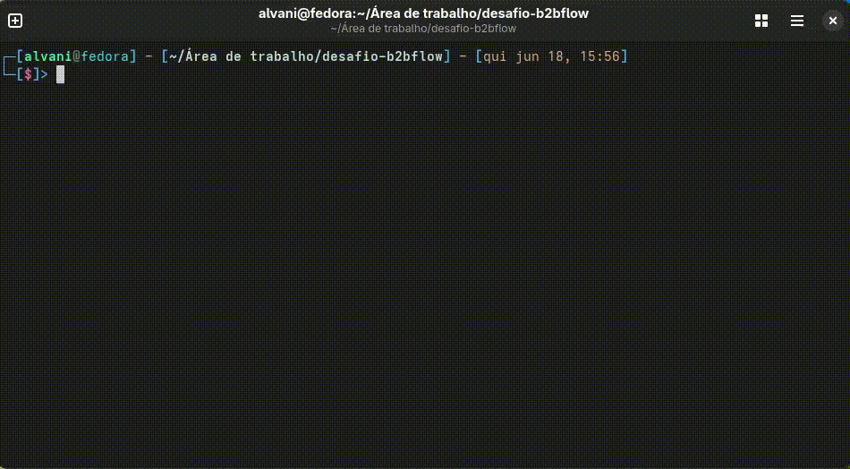

# 🚀 Desafio B2BFlow - Estágio em Desenvolvimento Python

Automação para envio de mensagens via WhatsApp utilizando **Supabase** como fonte de dados e **Z-API** como gateway de comunicação.

O sistema busca contatos cadastrados no Supabase, valida os números de telefone e envia uma mensagem personalizada para até 3 contatos utilizando a Z-API.

## 🎯 Objetivo

Ler contatos armazenados no Supabase e enviar a seguinte mensagem para cada um deles: `Olá <nome_contato>, tudo bem com você?`

Substituindo `<nome_contato>` pelo nome obtido no banco de dados.

## ✅ Funcionalidades

* Leitura de contatos armazenados no Supabase
* Envio de mensagens via Z-API
* Personalização da mensagem com o nome do contato
* Limitação de envio para os 3 primeiros contatos
* Validação básica de números de telefone
* Verificação da conexão da instância Z-API antes dos envios
* Tratamento de erros de integração
* Logs em arquivo e terminal
* Configuração via variáveis de ambiente

## 🏗️ Estrutura do Projeto

```text
desafio-b2bflow
├── assets
│   └── main.mp4
├── .env
├── exemplo_env.txt
├── .gitignore
├── README.md
├── requirements.txt
└── src
    ├── config.py
    ├── main.py
    ├── services
    │   ├── supabase_service.py
    │   └── zapi_service.py
    └── utils
        ├── logger.py
        ├── logs
        │   └── app.log
        └── validators.py
```

## 🗄️ Configuração do [Supabase](https://supabase.com)

1. Acesse [supabase.com](https://supabase.com) e crie sua conta.

2. Crie uma tabela chamada `contacts` com a seguinte estrutura:

| Coluna   | Tipo | Descrição                       |
| -------- | ---- | ------------------------------- |
| id       | uuid | Chave primária                  |
| nome     | text | Nome do contato                 |
| telefone | text | Número no formato 5511999999999 |

**Exemplo:**

| id | nome  | telefone      |
| -- | ----- | ------------- |
| 1  | Maria | 5511999999999 |
| 2  | João  | 5579999999999 |
| 3  | Paulo | 5582999999999 |

3. Copie a sua **URL Key** e **Secret Key** e adicione as credenciais ao arquivo `.env`:

## 📱 Configuração da [Z-API](https://app.z-api.io)

1. Acesse [app.z-api.io](https://app.z-api.io) e crie sua conta.  

2. Crie uma nova instância e conecte-a ao WhatsApp através da leitura do QR Code.

3. Após a conexão, copie os seguintes dados da instância:

   * Instance ID
   * Token
4. No painel da Z-API, acesse:

```text
Menu Principal → Segurança → Token de Segurança da Conta
```

5. Copie o **Client Token** gerado pela plataforma.

6. Adicione as credenciais ao arquivo `.env`.

### Observações
* A instância deve estar conectada ao WhatsApp para permitir o envio de mensagens.
* O `CLIENT_TOKEN` é obrigatório para autenticação das requisições.
* Caso o token não seja enviado corretamente, a API retornará:

```json
{
  "error": "your client-token is not configured"
}
```

* O projeto utiliza o endpoint de envio de mensagens de texto da Z-API para realizar os disparos.

## 🔑 Variáveis de Ambiente

Crie um arquivo `.env` na raiz do projeto baseado no arquivo `exemplo_env.txt` e preencha com as credenciais obtidas nos passos anteriores:

No final, o arquivo .env deve estar assim:
```env
ZAPI_INSTANCE_ID=seu_instance_id
ZAPI_TOKEN=seu_token_zapi
CLIENT_TOKEN=seu_client_token

SUPABASE_URL=https://seu-projeto.supabase.co
SUPABASE_KEY=sua_chave_supabase
```

## ⚙️ Instalação

Clone o repositório:

```bash
git clone https://github.com/alvanimiguel/desafio-b2bflow
```

Acesse a pasta do repositório:
```bash
cd desafio-b2bflow
```

Instale as dependências:

```bash
pip install -r requirements.txt
```

## ▶️ Execução

Execute o projeto:

```bash
python -m src.main
```



## 📝 Logs

Todas as ações são registradas no arquivo `/src/utils/logs/app.log` e no terminal.

Exemplo:

```text
2026-06-17 15:15:34 | INFO  | Iniciando aplicação
2026-06-17 15:15:35 | INFO  | 3 contatos encontrados
2026-06-17 15:15:35 | INFO  | Enviando mensagem para Maria
2026-06-17 15:15:35 | INFO  | Mensagem enviada para Maria | Status: 200
2026-06-17 15:15:35 | ERROR | Número inválido para Lucas: 912345678
2026-06-17 15:15:35 | INFO  | Processo finalizado
```

## 🛡️ Tratamento de Erros

O projeto realiza:

* Validação básica dos números de telefone antes do envio
* Tratamento de falhas de conexão com a Z-API antes da execução
* Interrupção automática caso o WhatsApp esteja desconectado
* Tratamento de falhas de conexão com a Z-API
* Registro detalhado de erros em log
* Continuidade da execução mesmo quando um contato apresenta erro

Exemplo de instância desconectada:
```text
2026-06-18 13:20:00 | INFO  | Iniciando aplicação
2026-06-18 13:20:00 | ERROR | Instância Z-API desconectada. Escaneie o QR Code e tente novamente.
```

## 🛠️ Tecnologias Utilizadas

* Python 3
* Supabase Python Client
* Z-API
* python-dotenv
* requests
* logging

## 👨‍💻 Autor

Desenvolvido por Alvani Miguel.
